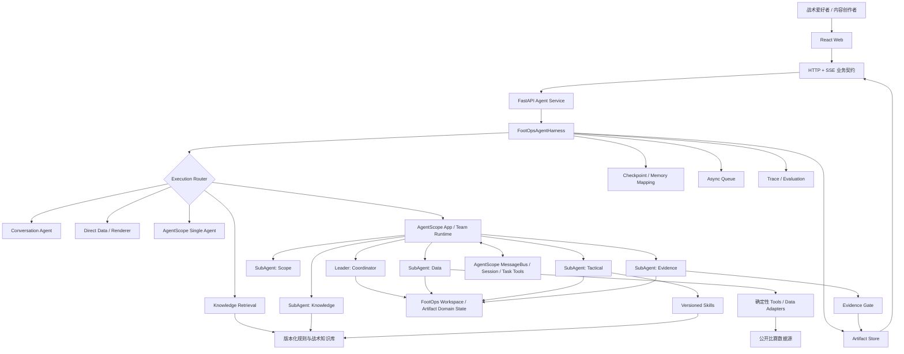

# FootOps MindBridge 对照架构

> 文档类型：Agent 与系统架构基线
> 基线日期：2026-07-31
> 参考项目：MindBridge 多 Agent 心理场景平台
> Agent 框架：AgentScope 2.0.5（已在项目环境核实）
> 暂定模型：DeepSeek，通过 AgentScope `DeepSeekChatModel` 接入

## 1. 文档目的

本文档只回答 FootOps 应该如何设计，重点说明：

- 哪些能力借鉴 MindBridge；
- Agent、Harness、Artifact 和数据工具如何协作；
- 哪些边界必须由确定性代码控制；
- 多 Agent 在什么条件下启用；
- 如何评测架构是否真正产生价值。

产品范围以 [FOOTOPS_REQUIREMENTS.md](./FOOTOPS_REQUIREMENTS.md) 为准，实施顺序
以 [FOOTOPS_DEVELOPMENT_ORDER.md](./FOOTOPS_DEVELOPMENT_ORDER.md) 为准。

## 1.1 当前实现边界

当前可运行的比赛数据链是**单球员、多场描述性指标分析**。StatsBomb Open Data 的原始
事件不只包含传球，也包含 `Shot` 等事件；但 FootOps v1 只实现了基础射门次数和射门参与，
尚未实现 xG、射正、进球质量、整场比赛复盘、两队对比或球队级战术分析。

当前模型主要负责意图理解、范围解析和受控工具选择；数据 Finding 和趋势图由确定性代码
生成。因此页面不会自动把指标变化写成战术因果。战术案例 RAG、指标口径 RAG 和联合
Evidence Gate 是后续把“数据变化”提升为“有依据的文字战术解释”的必要步骤。

## 2. MindBridge 学习原则

FootOps 不复制 MindBridge 的心理业务，而是复用其工程主线：

1. 面向明确垂直场景，不做通用聊天；
2. 先判断普通对话、知识检索、数据分析或联合分析，再选择直接工具、单 Agent 或多 Agent；
3. 用 AgentScope App/Team Runtime 处理复杂任务；
4. 用业务 Harness 组合框架运行时与 FootOps 生命周期；
5. 用 AgentScope 任务、团队消息和 FootOps Artifact 解耦 Agent；
6. 用 Evidence Gate 对应风险审核闭环；
7. 用 Engineering Harness 建立可重复验证环境；
8. 用 Skills、MCP、记忆和异步队列扩展业务能力；
9. 最终结果可追溯、可验证、可恢复。

## 3. MindBridge 能力映射

| MindBridge 能力 | FootOps 对应能力 |
| --- | --- |
| 心理意图路由 | 普通对话、规则问答、战术知识、数据分析和联合分析路由 |
| 心理知识检索 | IFAB/FIFA 规则、战术案例、指标定义、数据口径和分析模板检索 |
| Risk Safety | Evidence Review、来源和不确定性检查 |
| 高风险预警闭环 | 低证据结论阻断、补证、降级和人工确认 |
| CoordinatorAgent | AgentScope Team Leader 对应的 FootOps Coordinator 角色 |
| EventDrivenMultiAgent | AgentScope App/Team、Session、MessageBus、任务工具和 SubAgentTemplate 的组合 |
| CollaborationBlackboard | AgentScope TaskContext/任务工具 + FootOps Workspace/Artifact 领域投影 |
| 心理业务 Skill | 球员角色、推进、压迫、证据和战术板 Skills |
| Excel、预警、备注 MCP | 足球数据、网页检索、图表和报告 MCP |
| 报告落库 | Workspace、Artifacts、引用和报告持久化 |
| Run Trace | 管理端可观测性、评测和故障分析 |
| Engineering Harness | 固定数据夹具、故障注入和回归评测 |

## 4. 系统总览

### 4.1 系统架构图

以下 Mermaid 是当前 AgentScope-first 架构的权威版本。`diagrams/` 中旧版 SVG/PNG
仍用于历史对照，重新生成前不得作为开发依据。

### 4.2 可检索流程图



## 5. 分层职责

| 层级 | 主要职责 | 不应该负责 |
| --- | --- | --- |
| React Web | 交互、图表、战术板、业务状态 | Agent 编排和指标计算 |
| FastAPI | HTTP/SSE、认证边界、请求校验 | 战术推理 |
| FootOps Harness | 业务路由、预算、Artifact 采纳、恢复、持久化和 SSE | 重写 AgentScope 的会话、团队或消息总线 |
| AgentScope Runtime | Agent 循环、工具调用、团队、任务、消息和运行状态 | 足球指标、证据门禁和 UI |
| Tools | 数据读取、指标计算、格式转换 | 自由文本战术结论 |
| Skills | 可版本化分析方法和约束 | 保存用户密钥 |
| Artifact Store | 结构化产物、版本和关联 | 生成结论 |
| Data Providers | 比赛、阵容、事件和基础统计 | FootOps 业务状态 |

## 6. 执行路径

Agent 只用于需要理解、规划、工具选择、证据判断或多步修订的任务。

| 场景 | 执行路径 |
| --- | --- |
| 查询比分、赛程、积分榜 | 直接数据服务 |
| 查看已有指标或导出报告 | 确定性工具 |
| 普通问候或无需事实的交流 | ConversationAgent，不注册数据或 RAG 工具 |
| 解释规则或战术概念 | 单 Agent + Knowledge Retrieval |
| 简单单场分析 | 目标路径：单 Agent + Tools；当前比赛数据链尚未覆盖 |
| 球员多场描述性变化 | 单 Agent + Data Tools |
| 球员角色原因、阵型职责或案例对照 | DataAgent + KnowledgeAgent + TacticalAgent + EvidenceAgent |
| 数据冲突或证据不足 | EvidenceAgent + 有界补证循环 |
| 修改范围并局部重算 | Harness 从 Checkpoint 恢复 |

路由结果不能只有互斥的单标签，因为复杂问题可能同时需要比赛数据和知识检索。目标输出
使用结构化执行计划：

```json
{
  "intent": "hybrid_tactical_analysis",
  "need_match_data": true,
  "need_rule_rag": false,
  "need_tactical_rag": true,
  "need_multi_agent": true,
  "scope_complete": false
}
```

## 7. Agent 设计

目标架构定义 6 个业务角色。当前已运行 Coordinator、Data、Tactical、Evidence 四角色，
ScopeAgent 已作为多 Agent 前置范围角色运行，KnowledgeAgent 已完成独立规则问答切片；
联合编排职责稳定后再注册为 AgentScope
`SubAgentTemplate`，由 Team Leader 按需创建或邀请。不是每次请求都实例化或调用全部
角色，也不为这些角色自研另一套 Agent 基类和注册中心。

### 7.1 CoordinatorAgent

- 消费入口意图与 ScopeAgent 的结构化结果；
- 判断走知识检索、直接数据、单 Agent 或多 Agent，以及是否需要联合分析；
- 创建任务和验收条件；
- 使用 AgentScope 任务工具发布任务，并把验收条件关联到 FootOps Workspace；
- 汇总 Artifacts；
- 决定补证、降级、停止或交付；
- 生成最终面向用户的回答结构。

CoordinatorAgent 不直接编造比赛数据，也不替代 EvidenceAgent 审核。

### 7.2 ScopeAgent

- 将自然语言中的赛事、赛季、球队、球员、比赛和窗口解析为受控实体；
- 检查范围是否完整、歧义和数据覆盖；
- 只发布 `AnalysisScopeArtifact`，不生成战术结论；
- 缺少必要范围时提出最少量澄清问题。

### 7.3 DataAgent

- 选择合适的数据源；
- 获取比赛、阵容、事件和基础统计；
- 标准化不同数据源字段；
- 调用确定性指标计算工具；
- 发布 DatasetArtifact 和 MetricArtifact；
- 标注时间、覆盖范围、缺失值和来源。

### 7.4 KnowledgeAgent

- 根据执行计划检索规则、战术概念、案例、指标口径和分析模板；
- 使用版本、章节、场景和来源类型过滤知识；
- 发布 `KnowledgeEvidenceArtifact`，不把检索文本直接当成比赛事实；
- 检索不到可靠来源时明确返回空结果，不使用模型常识补造引用。

### 7.5 TacticalAgent

- 读取 MetricArtifact、KnowledgeEvidenceArtifact 和战术 Skill；
- 区分数据事实、战术解释和合理推断；
- 发布 FindingArtifact 和 `TacticalHypothesisArtifact`；
- 生成结构化 TacticsBoardArtifact；
- 根据审核结果修改结论。

### 7.6 EvidenceAgent

- 检查每条结论是否存在数据或知识来源；
- 校验数值与 MetricArtifact 是否一致；
- 检查来源可信度、时效性和范围；
- 识别相互矛盾的数据；
- 返回通过、补证、降级或拒绝；
- 发布 EvidenceReviewArtifact。

EvidenceAgent 对应 MindBridge 的 SafetyAgent，但审核对象是分析可靠性，不是
心理高风险事件。

## 8. Phase 3A 领域协作、AgentScope 编排与 FootOps 状态

MindBridge 的 `EventDrivenMultiAgent + CollaborationBlackboard` 在 FootOps 中按学习顺序
对应三层组合：

1. Phase 3A 最小领域协作层负责可观察的 Task Claim、Artifact、Event、轮次预算和
   Final Accept，用于学习原理和建立对照，不提供通用消息总线或持久化；
2. AgentScope App/Team Runtime 负责通用运行能力：Agent/Session、Leader/SubAgent、
   `SubAgentTemplate`、框架注入的 `AgentCreate`、`AgentInvite`、`TeamSay`、任务工具，
   以及 MessageBus 和 Storage；
3. FootOps `AnalysisWorkspace` 与强类型 Artifact 负责足球领域状态：分析范围、验收条件、
   指标、Finding、证据审核、依赖关系和可交付状态。

`AgentCreate`、`AgentInvite` 和 `TeamSay` 是 App Runtime 为 Agent 组装的团队工具，FootOps
不应依赖其私有模块路径直接实例化。业务代码通过 `create_app`、`SubAgentTemplate`、
`extra_agent_tools` 等公开入口接入。

需要跨 Agent 共享的最小领域状态仍然是：

```text
run_id
workspace_id
user_goal
analysis_scope
acceptance_criteria
artifacts[]
evidence_reviews[]
dependencies[]
revision_count
budgets
status
```

其中通用任务状态优先放在 AgentScope `TaskContext` 和 `TaskCreate`/`TaskGet`/`TaskList`/
`TaskUpdate` 中；`AnalysisWorkspace` 只保存业务验收与 Artifact 引用。只有经过能力 Spike
证明框架事件无法表达某个领域状态时，才增加薄的 `domain_state.py` 投影，不得重新实现
消息总线、Agent 注册中心或通用任务调度器。

复杂分析流程：

```text
Team Leader 创建任务并按模板创建/邀请 SubAgent
  -> AgentScope MessageBus/TeamSay 传递工作指令和结果通知
  -> Data 角色调用只读数据与指标 Tools，发布 Artifact 引用
  -> Tactical 角色基于 MetricArtifact 生成 Finding 草案
  -> Evidence 角色审阅，确定性 Evidence Gate 最终裁决
  -> Leader 选择补证、降级或采纳
  -> FootOps Harness 映射并持久化 Workspace，输出业务 SSE
```

约束：

- Leader 按 `SubAgentTemplate` 描述和工具权限分派任务；
- 任务显式声明依赖和验收条件；
- AgentScope 负责消息传输和任务状态，Agent 通过 Artifact 引用交付业务结果；
- 同一 Artifact 修改生成新版本；
- 最大修订次数由 Harness 控制；
- 数值冲突以确定性工具结果为准。

## 9. Artifact 设计

核心 Artifact：

| Artifact | 生产者 | 用途 |
| --- | --- | --- |
| AnalysisPlanArtifact | Coordinator | 分析任务和验收标准 |
| DatasetArtifact | DataAgent | 数据快照、字段和覆盖范围 |
| MetricArtifact | DataAgent | 确定性指标结果 |
| FindingArtifact | TacticalAgent | 结构化战术结论 |
| EvidenceReviewArtifact | EvidenceAgent | 结论审核结果 |
| TacticsBoardArtifact | TacticalAgent | 可编辑战术板数据 |
| ReportArtifact | Harness | 最终报告和引用 |

FindingArtifact 最低字段：

```json
{
  "finding_id": "finding_01",
  "statement": "球员接球区域在最近比赛中前移",
  "claim_type": "inference",
  "metric_refs": ["metric_12", "metric_19"],
  "source_refs": ["source_01"],
  "time_range": "selected_matches",
  "confidence": 0.86,
  "limitations": ["sample_size_is_small"]
}
```

TacticsBoardArtifact 最低字段：

```json
{
  "pitch_orientation": "vertical_attacking_up",
  "formation": "4-3-3",
  "players": [],
  "zones": [],
  "arrows": [],
  "passing_lanes": [],
  "annotations": [],
  "evidence_refs": []
}
```

前端只消费 Schema，不解析模型生成的自然语言坐标。

## 10. FootOpsAgentHarness

Harness 是 FootOps 业务边界，负责组合 AgentScope Runtime 与现有 Workspace 生命周期，
不替代模型推理，也不复制 AgentScope 已提供的会话、团队、消息和任务基础设施。

职责：

- 输入标准化和敏感信息处理；
- 创建 `run_id`、Workspace 和初始状态；
- 路由到直接工具、单 Agent 或 AgentScope Team；
- 设置修订、工具、时间、Token 和费用预算，并将单次 Agent 循环上限映射到
  `ReActConfig`；
- 根据业务路由和白名单组装或选择 AgentScope `Toolkit`；
- 将 AgentScope Session/Task/Event 映射为稳定的 FootOps Workspace/Artifact/SSE；
- 持久化消息、Artifacts、引用和报告；
- 管理超时、重试、幂等、取消和恢复；
- 保存 Checkpoint；
- 输出 SSE 业务事件；
- 执行 Evidence Gate；
- 标准化工具返回值；
- 记录脱敏 Run Trace。

运行循环：

```text
inspect
  -> clarify
  -> plan
  -> act
  -> verify
  -> revise or degrade
  -> persist
  -> deliver
```

终止条件：

- Evidence Gate 通过；
- 达到最大修订次数；
- 数据不足，只能输出降级回答；
- 用户取消；
- 时间或工具预算耗尽；
- 发生不可恢复的数据源错误。

## 11. Engineering Harness

Engineering Harness 建立独立、可重复的一键验证环境。

默认使用：

- 临时 SQLite；
- 内存消息和短期记忆；
- Fake Redis；
- 固定比赛 JSON Fixtures；
- Mock 外部数据源；
- Fake Model Responses；
- 禁止真实外部副作用。

验证链路：

1. Scope Routing
2. Direct Data
3. Player Role Analysis
4. Deterministic Metrics
5. Evidence Gate
6. Tactics Board Artifact
7. Checkpoint Resume
8. Async Report Queue

## 12. AgentScope 使用边界

### 12.1 版本事实与采用原则

FootOps 当前锁定 `agentscope==2.0.5`。本地包源码和可运行测试是实现依据；官网其他
版本的示例只用于理解概念，不能直接复制 API。已核实本地 2.0.5 没有
`agentscope.pipeline`，因此当前架构不得写入 `Pipeline` 或 `MsgHub`。

本地包中存在 `agentscope.app.create_app`、`SubAgentTemplate`、MessageBus、Storage、
团队工具和任务工具，但 FootOps 当前仅安装基础依赖；导入 `agentscope.app` 会因缺少
`apscheduler` 失败。Phase 3 必须先显式引入并锁定 AgentScope `service` 及所选 Storage
extra，再通过集成测试验证挂载到现有 FastAPI 的方式。这些 App/Team 能力目前属于
“已审计、未接入”；Phase 3A 领域协作已经运行。

原则是“先理解协作语义，再映射框架”：Phase 3A 只实现最小领域协议；Agent 生命周期、
ReAct、Toolkit、Skill/MCP、SubAgent、团队通信和 Session/Storage 等通用能力仍优先验证
2.0.5，只有记录明确缺口和 ADR 后才允许自研替代。

### 12.2 能力采用表

| AgentScope 2.0.5 能力 | FootOps 用途 | 当前状态 |
| --- | --- | --- |
| `Agent`、`ReActConfig`、结构化输出 | 单 Agent 推理与 Schema 输出 | Phase 2B 已接入 |
| `Toolkit`、`FunctionTool`、Skill、MCP | 数据/指标工具与业务方法加载 | Toolkit/FunctionTool/Skill 已接入，MCP 待接入 |
| `ContextConfig`、`AgentState` | 上下文压缩和单 Agent 运行状态 | Phase 2B 已接入 |
| `TaskContext`、四个 Task Tools | 通用任务拆分与状态更新 | Phase 3B 待映射；Phase 3A 有领域 Task 对照 |
| `create_app`、`SubAgentTemplate` | Team Leader 与领域 SubAgent 组装 | Phase 3B 待接入；当前缺 `service` extra |
| App 团队工具 | 创建、邀请 SubAgent 与团队通信 | Phase 3 待接入，不直接导入私有类 |
| `InMemoryMessageBus` / `RedisMessageBus` | 跨 Session 实时消息和唤醒 | Phase 3 待选型 |
| `RedisStorage` / `AsyncSQLAlchemyStorage` | Agent、Session、Team 等框架状态 | Phase 3 待选型 |
| `LocalWorkspaceManager` 等 | Agent 文件工作目录和隔离 | Phase 3 待选型；不同于 AnalysisWorkspace |
| FootOps `AnalysisWorkspace` | 足球领域产物和验收状态 | 已有进程内基线；不由框架类型替代 |

### 12.3 AgentScope 负责的范围

- `Agent` 内置的 reasoning-acting（ReAct）循环，通过 `ReActConfig` 配置；
- `Agent.reply()` / `reply_stream()` 的 `structured_schema` 结构化输出；
- `Toolkit` 统一注册和管理 Tools、MCP 与 Agent Skills；
- `ContextConfig`、`AgentState` 与上下文压缩；
- `TaskContext` 和任务工具；
- App 的 Agent/Session/Team 生命周期；
- `SubAgentTemplate` 和 App 注入的团队协作工具；
- MessageBus、Storage 与工作区隔离的框架边界；
- 框架实际提供并经本项目测试通过的 Steering、Tracing 与 Evaluation 能力。

AgentScope 2.0.5 的公开 Agent 基线是统一的 `Agent`，其内部执行有界 ReAct
loop，不再使用独立的旧版 Agent 类名作为架构入口。`Agent` 接收
`DeepSeekChatModel` 和 `Toolkit`；FootOps Harness 只控制一次业务运行是否调用
Agent、调用哪个 Agent 以及外层预算和终止条件，不重写模型推理循环。

`structured_schema` 是每次 `reply()` 或 `reply_stream()` 调用传入的 Pydantic 模型
类，用于约束并校验该次最终结构化输出，结果位于最终消息的
`structured_output`；使用 `reply_stream()` 时需启用最终消息输出才能读取该字段。
它不替代 FootOps 对路由、工具参数、Artifact、证据和持久化契约的业务校验。

`Toolkit` 是 AgentScope Agent 获取 Tools、MCP 和 Skills 的统一入口，负责工具 Schema
与调用执行；FootOps 负责提供只读领域工具、白名单和参数约束，以及把工具结果转换为
Artifact、执行 Evidence Gate 和业务审计。

### 12.4 FootOps 保留的业务范围

- FootOps ModelAdapter；
- FootOpsAgentHarness；
- 足球业务路由；
- Artifact Schema；
- AnalysisWorkspace、Artifact 依赖和验收状态；
- Evidence Gate；
- 数据源适配和指标计算；
- 战术板 Schema；
- Engineering Harness。

FootOps Phase 3A 已建立最小 `AgentRegistry` 和 `CollaborationBoard`，只表达领域 Task、
Artifact 和采纳语义。它不得扩展为通用 MessageBus、Session、Storage 或 Scheduler；这些
能力在 Phase 3B 映射 AgentScope。若框架无法满足要求，再用测试复现缺口并写 ADR。

AgentScope `WorkspaceManager` 管理 Agent 的文件工作目录和隔离，FootOps
`AnalysisWorkspace` 管理一次足球分析的业务产物与状态；二者必须通过映射关联，不能因
名称相同而合并。

框架升级必须运行完整 Engineering Harness。

## 13. 模型策略

- 使用 AgentScope `DeepSeekChatModel` 作为 `ChatModelBase` 的 DeepSeek 实现，并
  注入 `Agent(model=...)`；
- FootOps ModelAdapter 只负责模型配置、凭据注入和模型档位选择，向 Agent 构建层
  提供已配置的 AgentScope 模型实例，不重复实现模型调用、流式响应或工具调用
  协议；
- FootOpsAgentHarness 消费 ModelAdapter 和 Agent，不直接调用 DeepSeek SDK；
- Agent 业务代码不得直接依赖供应商 SDK；
- 路由、Artifact 和工具参数必须经过 Schema 校验；
- 模型和 Thinking 策略由环境配置；
- 低成本模型用于范围识别、摘要和格式修复；
- 高能力模型只用于复杂跨比赛解释和证据冲突；
- MVP 可以只启用一个模型，先建立质量基线；
- 原始推理内容不写入用户报告。

## 14. Skills

初始 Skills：

```text
skills/
  player-role-analysis/
  match-analysis/
  build-up-analysis/
  pressing-analysis/
  tactics-board/
  evidence-review/
  report-writing/
```

每个 Skill 至少定义：

- 适用范围和不适用范围；
- 必需输入；
- 数据要求；
- 执行步骤；
- 工具白名单；
- 输出 Artifact Schema；
- 证据要求；
- 失败和降级策略；
- 测试样例；
- `skill_version`。

Coordinator 先读取 Skill 摘要，路由确定后再加载完整内容。

## 15. Tools 与 MCP

稳定的本地指标计算优先使用 AgentScope `FunctionTool` 适配并注册到 `Toolkit`，
不把所有 Python 函数都包装为 MCP。

本地确定性 Tools：

```text
audit_data_coverage
load_match_events
normalize_event_data
calculate_player_metrics
calculate_team_metrics
build_touch_heatmap
validate_metric_consistency
render_tactics_board
render_report
```

计划中的 MCP：

```text
football-data-mcp
statsbomb-open-mcp
web-research-mcp
document-export-mcp
```

MCP 约束：

- 默认只读；
- 每个 Agent 使用工具白名单；
- 设置超时、限流和幂等键；
- 网页和工具文本视为不可信输入；
- 返回来源、获取时间和错误状态；
- 外部副作用必须由用户确认；
- 密钥不进入 Prompt、Trace 或 Artifact。

## 16. Knowledge RAG

RAG 是 FootOps 战术推理的知识证据层，不是比赛事实数据库，也不以“接入向量库”本身作为
项目卖点。它解决的是模型需要依据什么规则、概念、案例和模板解释数据。

### 16.1 知识域

| 知识域 | 示例 | 主要用途 |
| --- | --- | --- |
| 规则 | IFAB Laws of the Game、FIFA 赛事规程和官方解释 | 规则问答、判断案例适用条件 |
| 战术概念 | 阵型职责、半空间、第三人、压迫、推进和防守原则 | 解释术语、形成候选假设 |
| 战术案例 | 已授权比赛复盘、教练材料和高质量案例 | 目标能力；当前尚未建立授权案例库 |
| 指标口径 | FootOps 指标定义、StatsBomb 字段说明 | 目标能力；当前主要由代码和 Skill 约束 |
| 分析模板 | 球员角色、单场复盘、内容提纲模板 | 约束分析步骤和交付结构 |
| 已审核报告 | FootOps 已通过 Evidence Gate 的历史报告 | 复用方法，不复制未经验证结论 |

足球竞赛通则以 IFAB 为首要规则来源；FIFA 文档按赛事规程、竞赛规定或官方解释独立记录，
不能把两者统一标成“FIFA 规则”。每个知识块至少保存 `source_id`、发布机构、标题、版本、
生效日期、章节、知识域、适用场景、原文位置、来源 URL、授权状态和内容哈希。

### 16.2 检索链

```text
ExecutionPlan
  -> domain/version/scenario metadata filter
  -> BM25 + vector hybrid retrieval
  -> reranker
  -> diversity and contradiction selection
  -> KnowledgeEvidenceArtifact
```

切分以规则条款、战术概念单元、案例阶段和模板步骤为边界，不使用无语义的固定字符切分。
规则检索优先版本和章节精确匹配；战术案例检索同时保留支持例和反例。生成回答前，
EvidenceAgent 必须检查引用是否真的支持对应主张。

当前规则和战术概念学习切片使用 `BM25 + 字符 n-gram 稀疏向量 + 确定性 rerank`，优点是零外部
Embedding 依赖、中文规则测试可重复、组件分数可审计；缺点是跨语言语义召回和同义表达
能力有限。因此它是混合检索契约和评测基线，不等同于生产级 dense semantic embedding。
后续引入语义模型时必须与该基线做 Recall@K、MRR、引用正确率、延迟和资源占用对照。

### 16.3 不进入 RAG 的内容

- 应从数据 Provider 获取的比分、阵容、事件和比赛指标；
- 未经确认的伤停、新闻和转会信息；
- 模型自行生成但未审核的事实或战术结论；
- 没有授权或来源无法追踪的战术资料。

比赛事实优先来自结构化数据，指标由确定性代码计算。复杂结论允许同时引用
`MetricArtifact` 和 `KnowledgeEvidenceArtifact`，但两类引用必须在 Artifact 中明确区分。

### 16.4 Agent 使用方式

- 纯规则问题：KnowledgeAgent 检索后由单 Agent 组织答案，不启动比赛数据链；
- 纯描述性数据问题：DataAgent 计算并审核，不强制进入 RAG；
- 战术解释问题：DataAgent 与 KnowledgeAgent 分别发布证据，TacticalAgent 形成候选假设；
- 证据不足或冲突：EvidenceAgent 发布 critique，TacticalAgent 在轮次预算内修订、降级或拒绝；
- 所有对外战术结论必须标记 `fact`、`knowledge` 或 `inference`，不把案例相似性写成因果事实。

## 17. 记忆与上下文压缩

| 层级 | 内容 | 计划存储 |
| --- | --- | --- |
| 当前运行 | Agent 上下文、任务和团队消息 | AgentScope AgentState/TaskContext/Session |
| 当前业务分析 | 范围、Artifacts、审核和依赖 | FootOps AnalysisWorkspace |
| 短期会话 | 最近对话和引用 | AgentScope Storage；后端按 Spike 选型 |
| 历史会话 | 消息和报告索引 | 关系数据库 |
| 长期偏好 | 球队、语言、分析深度 | Preference Store |

可记忆：

- 用户偏好的球队和赛事；
- 默认分析深度；
- 图表和战术板偏好；
- 用户主动保存的研究主题。

不可记忆：

- 模型隐式推理；
- 未经确认的事实；
- 应重新获取的比分和阵容；
- API Key 和认证信息。

长对话压缩时必须保留：

- 最近若干轮原始对话；
- 结构化 `memoryBrief`；
- 成对的工具调用和结果；
- Artifact 引用；
- 当前分析范围和用户修订。

## 18. 异步任务

实时链路：

- 范围识别；
- 核心数据读取；
- 关键指标计算；
- 流式回答；
- 证据摘要。

异步链路：

- 批量比赛数据同步；
- 长报告生成；
- PDF、图片和表格导出；
- 战术板高清渲染；
- 失败数据源重试；
- 离线评测。

异步任务必须支持幂等、最大重试、指数退避、限流、取消、Dead Letter 和
`run_id` 关联。

## 19. Evidence Gate

通过条件：

- 关键数值均引用 MetricArtifact；
- 关键事实均有 SourceRef；
- 推断明确标记为推断；
- 时间范围一致；
- 来源不是失效或低可信状态；
- 不存在未解释的数据冲突；
- 战术板标注可以追溯到 FindingArtifact。

证据不足时按顺序处理：

1. 补充检索；
2. 缩小结论范围；
3. 降低置信度并说明限制；
4. 无法支持时明确回答数据不足。

## 20. 战术板

支持：

- 球员拖动；
- 阵型选择；
- 跑位箭头；
- 传球线路；
- 区域标记；
- 图层显隐和排序；
- 撤销、重做和清空；
- 从 Finding 同步；
- 保存版本；
- 导出 PNG/PDF；
- AI 标记关联 EvidenceRef。

AI 只生成结构化战术板数据，前端负责确定性渲染和编辑。

## 21. 可观测性与隐私

Trace 记录：

- Run、Agent 和工具耗时；
- 模型名称、Token 和费用；
- 工具参数摘要和返回状态；
- Artifact 和 Skill 版本；
- 路由和 Evidence Gate 决策；
- 错误、重试和取消。

Trace 不记录：

- API Key；
- 未脱敏用户数据；
- 完整 Chain of Thought；
- 受限制数据源的原始大批量内容。

## 22. 评测

### 22.1 业务指标

所有数值都是验收目标，不是当前成果。

| 指标 | 目标 |
| --- | --- |
| 端到端耗时降低 | 相比人工中位耗时至少降低 60% |
| 任务完成率 | 不低于 90% |
| 可用初稿轮次 | 中位数不超过 3 轮 |
| 分析可用性 | 人工评分平均不低于 4/5 |
| 局部修订效率 | 未被无关重算的 Artifact 不低于 80% |

### 22.2 Agent 与产物指标

| 指标 | 目标 |
| --- | --- |
| Intent Accuracy | 不低于 90% |
| Metric Consistency | 100% |
| Claim Support Rate | 不低于 95% |
| Unsupported High-confidence Claim | 0 |
| Citation Correctness | 不低于 95% |
| Board Schema Validity | 100% |
| Evidence Link Coverage | 不低于 90% |
| Checkpoint Resume Success | 不低于 95% |

### 22.3 对照实验

同一批黄金任务比较：

| 基线 | 能力 |
| --- | --- |
| A：直接 LLM | 单次 Prompt，不调用工具 |
| B：单 Agent | Tools、Skills 和结构化输出 |
| C：FootOps | Harness + AgentScope Team + Evidence Gate 和 Checkpoint |

多 Agent 不是预设胜者。若 C 相比 B 未显著改善 Claim Support 或严重错误，
对应请求默认使用单 Agent。

## 23. 前后端契约

前端不依赖 AgentScope 类型，只依赖 FootOps 业务 Schema。

初始 API：

```text
GET    /health
POST   /api/v1/analyses
GET    /api/v1/analyses/{run_id}
GET    /api/v1/analyses/{run_id}/events
POST   /api/v1/tactics-boards
PATCH  /api/v1/tactics-boards/{board_id}
GET    /api/v1/reports/{report_id}
POST   /api/v1/reports/{report_id}/exports
```

SSE 业务事件：

```text
analysis.accepted
analysis.status
answer.delta
evidence.ready
tactics_board.ready
analysis.completed
analysis.failed
```

## 24. 目标项目结构

本节只给出高层目录。精确到文件的定义位置、依赖方向和新增功能落位规则，以
[FOOTOPS_PROJECT_STRUCTURE_STANDARD.md](./FOOTOPS_PROJECT_STRUCTURE_STANDARD.md)
为准。

```text
FootOps/
├── apps/
│   └── web/
├── services/
│   └── agent/
│       ├── skills/           # AgentScope LocalSkillLoader 读取的领域 Skills
│       ├── src/footops_agent/
│       │   ├── api/
│       │   ├── agents/
│       │   ├── runtime/       # AgentScope Agent/App/Team 组装与业务映射
│       │   ├── harness/
│       │   ├── artifacts/
│       │   ├── services/
│       │   ├── providers/
│       │   ├── repositories/
│       │   ├── tools/
│       │   ├── mcp/
│       │   ├── memory/
│       │   ├── workers/
│       │   ├── observability/
│       │   ├── prompts/
│       │   └── core/
│       ├── tests/
│       │   ├── unit/
│       │   ├── integration/
│       │   └── engineering_harness/
│       └── pyproject.toml
├── contracts/
├── docs/
├── infra/
└── README.md
```

## 25. 架构固定决策

1. 用户主界面不是 Runtime 监控后台；
2. 用户界面不出现 Loop、Harness 和 Agent 名称；
3. 目标架构定义 Coordinator、Scope、Data、Knowledge、Tactical、Evidence 六个逻辑角色，
   但按需调用；
4. 多 Agent 必须通过单 Agent 对照实验证明价值；
5. 数值由确定性代码计算；
6. 复杂结论必须经过 Evidence Gate；
7. 战术板由结构化 Artifact 驱动；
8. Harness 组合 AgentScope 与 FootOps 业务生命周期，不复制框架通用编排能力；
9. Skills 必须版本化并包含测试；
10. MCP 默认只读并使用工具白名单；
11. RAG 不保存实时比赛事实；
12. Python Agent Service 可独立运行；
13. Java 平台只能通过稳定 HTTP/SSE 契约接入。
14. AgentScope 2.0.5 本地 API 与测试是版本事实，禁止混用其他版本的类名；
15. Knowledge RAG 必须保留版本、章节、原文位置和授权状态；
16. 战术结论必须区分数据事实、知识引用和模型推断。
15. 自研通用多 Agent 基础设施前，必须先形成可复现的框架缺口和 ADR。
