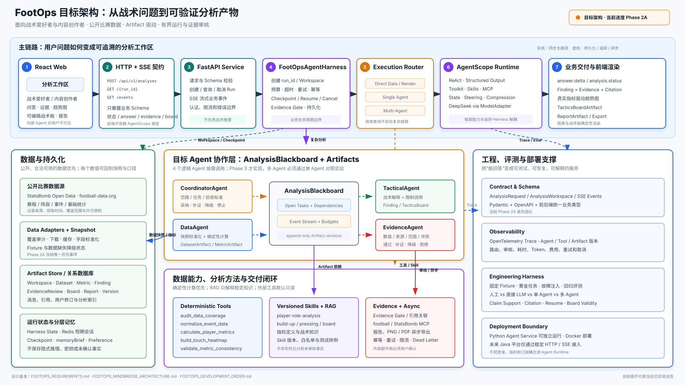
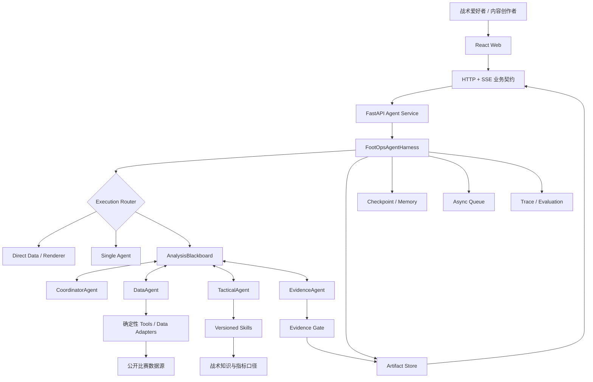
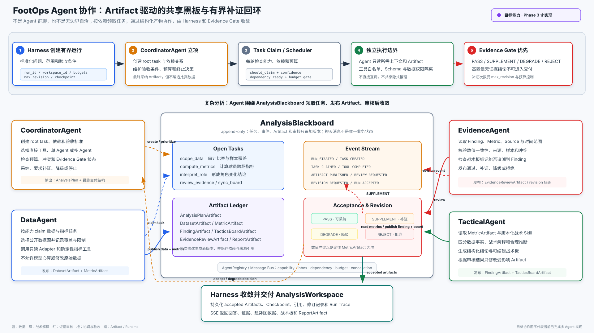

# FootOps MindBridge 对照架构

> 文档类型：Agent 与系统架构基线
> 基线日期：2026-07-31
> 参考项目：MindBridge 多 Agent 心理场景平台
> Agent 框架：AgentScope 2.0.5（已在项目环境核实）
> 暂定模型：DeepSeek，通过 AgentScope `DeepSeekChatModel` 接入

## 1. 文档目的

本文档只回答 FootOps 应该如何设计，重点说明：

- 哪些能力借鉴 MindBridge；
- Agent、Harness、Artifact 和数据工具如何协作；
- 哪些边界必须由确定性代码控制；
- 多 Agent 在什么条件下启用；
- 如何评测架构是否真正产生价值。

产品范围以 [FOOTOPS_REQUIREMENTS.md](./FOOTOPS_REQUIREMENTS.md) 为准，实施顺序
以 [FOOTOPS_DEVELOPMENT_ORDER.md](./FOOTOPS_DEVELOPMENT_ORDER.md) 为准。

## 2. MindBridge 学习原则

FootOps 不复制 MindBridge 的心理业务，而是复用其工程主线：

1. 面向明确垂直场景，不做通用聊天；
2. 通过路由选择直接工具、单 Agent 或多 Agent；
3. 用事件驱动 Runtime 处理复杂任务；
4. 用 Runtime Harness 管理一次业务运行；
5. 用 Blackboard 和 Artifact 解耦 Agent；
6. 用 Evidence Gate 对应风险审核闭环；
7. 用 Engineering Harness 建立可重复验证环境；
8. 用 Skills、MCP、记忆和异步队列扩展业务能力；
9. 最终结果可追溯、可验证、可恢复。

## 3. MindBridge 能力映射

| MindBridge 能力 | FootOps 对应能力 |
| --- | --- |
| 心理意图路由 | 战术问题范围识别与执行链路路由 |
| 心理知识检索 | 战术知识、指标定义和数据口径检索 |
| Risk Safety | Evidence Review、来源和不确定性检查 |
| 高风险预警闭环 | 低证据结论阻断、补证、降级和人工确认 |
| CoordinatorAgent | FootOps CoordinatorAgent |
| CollaborationBlackboard | AnalysisBlackboard |
| 心理业务 Skill | 球员角色、推进、压迫、证据和战术板 Skills |
| Excel、预警、备注 MCP | 足球数据、网页检索、图表和报告 MCP |
| 报告落库 | Workspace、Artifacts、引用和报告持久化 |
| Run Trace | 管理端可观测性、评测和故障分析 |
| Engineering Harness | 固定数据夹具、故障注入和回归评测 |

## 4. 系统总览

### 4.1 系统架构图



高清 PNG：
[footops-system-architecture.png](./diagrams/footops-system-architecture.png)

### 4.2 可检索流程图



## 5. 分层职责

| 层级 | 主要职责 | 不应该负责 |
| --- | --- | --- |
| React Web | 交互、图表、战术板、业务状态 | Agent 编排和指标计算 |
| FastAPI | HTTP/SSE、认证边界、请求校验 | 战术推理 |
| Agent Harness | 生命周期、预算、恢复、持久化、事件 | 替代模型推理 |
| Agent Runtime | 规划、工具选择、协作和修订 | 数据库事务和 UI |
| Tools | 数据读取、指标计算、格式转换 | 自由文本战术结论 |
| Skills | 可版本化分析方法和约束 | 保存用户密钥 |
| Artifact Store | 结构化产物、版本和关联 | 生成结论 |
| Data Providers | 比赛、阵容、事件和基础统计 | FootOps 业务状态 |

## 6. 执行路径

Agent 只用于需要理解、规划、工具选择、证据判断或多步修订的任务。

| 场景 | 执行路径 |
| --- | --- |
| 查询比分、赛程、积分榜 | 直接数据服务 |
| 查看已有指标或导出报告 | 确定性工具 |
| 解释战术概念 | 单 Agent + Skill，按需检索 |
| 简单单场分析 | 单 Agent + Tools |
| 球员多场角色变化 | 多 Agent 深度链路 |
| 数据冲突或证据不足 | EvidenceAgent + 有界补证循环 |
| 修改范围并局部重算 | Harness 从 Checkpoint 恢复 |

路由结果使用结构化枚举：

```text
DIRECT_DATA
SINGLE_AGENT_ANALYSIS
MULTI_AGENT_ANALYSIS
TACTICS_BOARD_UPDATE
REPORT_RENDER
CLARIFICATION_REQUIRED
```

## 7. Agent 设计

目标架构定义 4 个逻辑 Agent。Phase 2 先建立单 Agent 基线，Phase 3 再按职责
拆分。不是每次请求都实例化或调用全部 Agent。

### 7.1 CoordinatorAgent

- 识别用户意图、实体、比赛范围和时间范围；
- 判断走直接工具、单 Agent 或多 Agent；
- 创建任务和验收条件；
- 在 AnalysisBlackboard 上发布任务；
- 汇总 Artifacts；
- 决定补证、降级、停止或交付；
- 生成最终面向用户的回答结构。

CoordinatorAgent 不直接编造比赛数据，也不替代 EvidenceAgent 审核。

### 7.2 DataAgent

- 选择合适的数据源；
- 获取比赛、阵容、事件和基础统计；
- 标准化不同数据源字段；
- 调用确定性指标计算工具；
- 发布 DatasetArtifact 和 MetricArtifact；
- 标注时间、覆盖范围、缺失值和来源。

### 7.3 TacticalAgent

- 读取 MetricArtifact 和战术 Skill；
- 区分数据事实、战术解释和合理推断；
- 发布 FindingArtifact；
- 生成结构化 TacticsBoardArtifact；
- 根据审核结果修改结论。

### 7.4 EvidenceAgent

- 检查每条结论是否存在数据或知识来源；
- 校验数值与 MetricArtifact 是否一致；
- 检查来源可信度、时效性和范围；
- 识别相互矛盾的数据；
- 返回通过、补证、降级或拒绝；
- 发布 EvidenceReviewArtifact。

EvidenceAgent 对应 MindBridge 的 SafetyAgent，但审核对象是分析可靠性，不是
心理高风险事件。

## 8. AnalysisBlackboard

Blackboard 是复杂分析的共享任务板，不是 Agent 群聊记录。



高清 PNG：
[footops-agent-collaboration.png](./diagrams/footops-agent-collaboration.png)

最小状态：

```text
run_id
workspace_id
user_goal
analysis_scope
acceptance_criteria
tasks[]
artifacts[]
evidence_reviews[]
dependencies[]
revision_count
budgets
status
```

复杂分析流程：

```text
Coordinator 创建任务
  -> DataAgent 领取数据和指标任务
  -> TacticalAgent 领取解释和战术板任务
  -> EvidenceAgent 审核 Findings
  -> Coordinator 选择补证、降级或采纳
  -> Harness 持久化并交付
```

约束：

- Agent 按能力领取任务；
- 任务显式声明依赖和验收条件；
- Agent 通过 Artifact 协作；
- 同一 Artifact 修改生成新版本；
- 最大修订次数由 Harness 控制；
- 数值冲突以确定性工具结果为准。

## 9. Artifact 设计

核心 Artifact：

| Artifact | 生产者 | 用途 |
| --- | --- | --- |
| AnalysisPlanArtifact | Coordinator | 分析任务和验收标准 |
| DatasetArtifact | DataAgent | 数据快照、字段和覆盖范围 |
| MetricArtifact | DataAgent | 确定性指标结果 |
| FindingArtifact | TacticalAgent | 结构化战术结论 |
| EvidenceReviewArtifact | EvidenceAgent | 结论审核结果 |
| TacticsBoardArtifact | TacticalAgent | 可编辑战术板数据 |
| ReportArtifact | Harness | 最终报告和引用 |

FindingArtifact 最低字段：

```json
{
  "finding_id": "finding_01",
  "statement": "球员接球区域在最近比赛中前移",
  "claim_type": "inference",
  "metric_refs": ["metric_12", "metric_19"],
  "source_refs": ["source_01"],
  "time_range": "selected_matches",
  "confidence": 0.86,
  "limitations": ["sample_size_is_small"]
}
```

TacticsBoardArtifact 最低字段：

```json
{
  "pitch_orientation": "vertical_attacking_up",
  "formation": "4-3-3",
  "players": [],
  "zones": [],
  "arrows": [],
  "passing_lanes": [],
  "annotations": [],
  "evidence_refs": []
}
```

前端只消费 Schema，不解析模型生成的自然语言坐标。

## 10. FootOpsAgentHarness

Harness 位于 AgentScope 外层，管理业务运行生命周期，不替代模型推理。

职责：

- 输入标准化和敏感信息处理；
- 创建 `run_id`、Workspace 和初始状态；
- 路由到直接工具、单 Agent 或多 Agent；
- 设置修订、工具、时间、Token 和费用预算，并将单次 Agent 循环上限映射到
  `ReActConfig`；
- 根据业务路由和白名单组装或选择 AgentScope `Toolkit`；
- 持久化消息、Artifacts、引用和报告；
- 管理超时、重试、幂等、取消和恢复；
- 保存 Checkpoint；
- 输出 SSE 业务事件；
- 执行 Evidence Gate；
- 标准化工具返回值；
- 记录脱敏 Run Trace。

运行循环：

```text
inspect
  -> clarify
  -> plan
  -> act
  -> verify
  -> revise or degrade
  -> persist
  -> deliver
```

终止条件：

- Evidence Gate 通过；
- 达到最大修订次数；
- 数据不足，只能输出降级回答；
- 用户取消；
- 时间或工具预算耗尽；
- 发生不可恢复的数据源错误。

## 11. Engineering Harness

Engineering Harness 建立独立、可重复的一键验证环境。

默认使用：

- 临时 SQLite；
- 内存消息和短期记忆；
- Fake Redis；
- 固定比赛 JSON Fixtures；
- Mock 外部数据源；
- Fake Model Responses；
- 禁止真实外部副作用。

验证链路：

1. Scope Routing
2. Direct Data
3. Player Role Analysis
4. Deterministic Metrics
5. Evidence Gate
6. Tactics Board Artifact
7. Checkpoint Resume
8. Async Report Queue

## 12. AgentScope 使用边界

使用 AgentScope：

- `Agent` 内置的 reasoning-acting（ReAct）循环，通过 `ReActConfig` 配置；
- `Agent.reply()` / `reply_stream()` 的 `structured_schema` 结构化输出；
- `Toolkit` 统一注册和管理 Tools、MCP 与 Agent Skills；
- Agent Skill；
- MCP；
- Memory Compression；
- Pipeline / MsgHub；
- State Management；
- Realtime Steering；
- OpenTelemetry Tracing；
- Evaluation。

AgentScope 2.0.5 的公开 Agent 基线是统一的 `Agent`，其内部执行有界 ReAct
loop，不再使用独立的旧版 Agent 类名作为架构入口。`Agent` 接收
`DeepSeekChatModel` 和 `Toolkit`；FootOps Harness 只控制一次业务运行是否调用
Agent、调用哪个 Agent 以及外层预算和终止条件，不重写模型推理循环。

`structured_schema` 是每次 `reply()` 或 `reply_stream()` 调用传入的 Pydantic 模型
类，用于约束并校验该次最终结构化输出，结果位于最终消息的
`structured_output`；使用 `reply_stream()` 时需启用最终消息输出才能读取该字段。
它不替代 FootOps 对路由、工具参数、Artifact、证据和持久化契约的业务校验。

`Toolkit` 是 AgentScope Agent 获取 Tools、MCP 和 Skills 的统一入口，负责工具
Schema 与调用执行；FootOps Harness 负责按路由、权限和预算选择 Toolkit 内容，
以及处理工具结果后的 Artifact、Evidence Gate、重试、恢复和审计。

自研部分：

- FootOps ModelAdapter；
- FootOpsAgentHarness；
- AnalysisBlackboard；
- 足球业务路由；
- Artifact Schema；
- Evidence Gate；
- 数据源适配和指标计算；
- 战术板 Schema；
- Engineering Harness。

框架升级必须运行完整 Engineering Harness。

## 13. 模型策略

- 使用 AgentScope `DeepSeekChatModel` 作为 `ChatModelBase` 的 DeepSeek 实现，并
  注入 `Agent(model=...)`；
- FootOps ModelAdapter 只负责模型配置、凭据注入和模型档位选择，向 Agent 构建层
  提供已配置的 AgentScope 模型实例，不重复实现模型调用、流式响应或工具调用
  协议；
- FootOpsAgentHarness 消费 ModelAdapter 和 Agent，不直接调用 DeepSeek SDK；
- Agent 业务代码不得直接依赖供应商 SDK；
- 路由、Artifact 和工具参数必须经过 Schema 校验；
- 模型和 Thinking 策略由环境配置；
- 低成本模型用于范围识别、摘要和格式修复；
- 高能力模型只用于复杂跨比赛解释和证据冲突；
- MVP 可以只启用一个模型，先建立质量基线；
- 原始推理内容不写入用户报告。

## 14. Skills

初始 Skills：

```text
skills/
  player-role-analysis/
  match-analysis/
  build-up-analysis/
  pressing-analysis/
  tactics-board/
  evidence-review/
  report-writing/
```

每个 Skill 至少定义：

- 适用范围和不适用范围；
- 必需输入；
- 数据要求；
- 执行步骤；
- 工具白名单；
- 输出 Artifact Schema；
- 证据要求；
- 失败和降级策略；
- 测试样例；
- `skill_version`。

Coordinator 先读取 Skill 摘要，路由确定后再加载完整内容。

## 15. Tools 与 MCP

稳定的本地指标计算优先使用 AgentScope `FunctionTool` 适配并注册到 `Toolkit`，
不把所有 Python 函数都包装为 MCP。

本地确定性 Tools：

```text
audit_data_coverage
load_match_events
normalize_event_data
calculate_player_metrics
calculate_team_metrics
build_touch_heatmap
validate_metric_consistency
render_tactics_board
render_report
```

计划中的 MCP：

```text
football-data-mcp
statsbomb-open-mcp
web-research-mcp
document-export-mcp
```

MCP 约束：

- 默认只读；
- 每个 Agent 使用工具白名单；
- 设置超时、限流和幂等键；
- 网页和工具文本视为不可信输入；
- 返回来源、获取时间和错误状态；
- 外部副作用必须由用户确认；
- 密钥不进入 Prompt、Trace 或 Artifact。

## 16. RAG

RAG 是辅助能力，不是 FootOps 的产品定义。

适合保存：

- 足球战术概念；
- 阵型、推进、压迫和防守原则；
- 指标定义与计算口径；
- 已授权分析资料；
- 数据源字段说明；
- FootOps 历史高质量报告。

不保存：

- 应从数据 API 获取的比分和阵容；
- 未经确认的伤停和新闻；
- 模型自行生成但未审核的事实。

比赛事实优先来自结构化数据，指标优先由确定性代码计算。

## 17. 记忆与上下文压缩

| 层级 | 内容 | 计划存储 |
| --- | --- | --- |
| 当前运行 | 问题、任务、Artifacts | Harness State |
| 短期会话 | 最近对话和引用 | Redis |
| 历史会话 | 消息和报告索引 | 关系数据库 |
| 长期偏好 | 球队、语言、分析深度 | Preference Store |

可记忆：

- 用户偏好的球队和赛事；
- 默认分析深度；
- 图表和战术板偏好；
- 用户主动保存的研究主题。

不可记忆：

- 模型隐式推理；
- 未经确认的事实；
- 应重新获取的比分和阵容；
- API Key 和认证信息。

长对话压缩时必须保留：

- 最近若干轮原始对话；
- 结构化 `memoryBrief`；
- 成对的工具调用和结果；
- Artifact 引用；
- 当前分析范围和用户修订。

## 18. 异步任务

实时链路：

- 范围识别；
- 核心数据读取；
- 关键指标计算；
- 流式回答；
- 证据摘要。

异步链路：

- 批量比赛数据同步；
- 长报告生成；
- PDF、图片和表格导出；
- 战术板高清渲染；
- 失败数据源重试；
- 离线评测。

异步任务必须支持幂等、最大重试、指数退避、限流、取消、Dead Letter 和
`run_id` 关联。

## 19. Evidence Gate

通过条件：

- 关键数值均引用 MetricArtifact；
- 关键事实均有 SourceRef；
- 推断明确标记为推断；
- 时间范围一致；
- 来源不是失效或低可信状态；
- 不存在未解释的数据冲突；
- 战术板标注可以追溯到 FindingArtifact。

证据不足时按顺序处理：

1. 补充检索；
2. 缩小结论范围；
3. 降低置信度并说明限制；
4. 无法支持时明确回答数据不足。

## 20. 战术板

支持：

- 球员拖动；
- 阵型选择；
- 跑位箭头；
- 传球线路；
- 区域标记；
- 图层显隐和排序；
- 撤销、重做和清空；
- 从 Finding 同步；
- 保存版本；
- 导出 PNG/PDF；
- AI 标记关联 EvidenceRef。

AI 只生成结构化战术板数据，前端负责确定性渲染和编辑。

## 21. 可观测性与隐私

Trace 记录：

- Run、Agent 和工具耗时；
- 模型名称、Token 和费用；
- 工具参数摘要和返回状态；
- Artifact 和 Skill 版本；
- 路由和 Evidence Gate 决策；
- 错误、重试和取消。

Trace 不记录：

- API Key；
- 未脱敏用户数据；
- 完整 Chain of Thought；
- 受限制数据源的原始大批量内容。

## 22. 评测

### 22.1 业务指标

所有数值都是验收目标，不是当前成果。

| 指标 | 目标 |
| --- | --- |
| 端到端耗时降低 | 相比人工中位耗时至少降低 60% |
| 任务完成率 | 不低于 90% |
| 可用初稿轮次 | 中位数不超过 3 轮 |
| 分析可用性 | 人工评分平均不低于 4/5 |
| 局部修订效率 | 未被无关重算的 Artifact 不低于 80% |

### 22.2 Agent 与产物指标

| 指标 | 目标 |
| --- | --- |
| Intent Accuracy | 不低于 90% |
| Metric Consistency | 100% |
| Claim Support Rate | 不低于 95% |
| Unsupported High-confidence Claim | 0 |
| Citation Correctness | 不低于 95% |
| Board Schema Validity | 100% |
| Evidence Link Coverage | 不低于 90% |
| Checkpoint Resume Success | 不低于 95% |

### 22.3 对照实验

同一批黄金任务比较：

| 基线 | 能力 |
| --- | --- |
| A：直接 LLM | 单次 Prompt，不调用工具 |
| B：单 Agent | Tools、Skills 和结构化输出 |
| C：FootOps | Harness、多 Agent、Evidence Gate 和 Checkpoint |

多 Agent 不是预设胜者。若 C 相比 B 未显著改善 Claim Support 或严重错误，
对应请求默认使用单 Agent。

## 23. 前后端契约

前端不依赖 AgentScope 类型，只依赖 FootOps 业务 Schema。

初始 API：

```text
GET    /health
POST   /api/v1/analyses
GET    /api/v1/analyses/{run_id}
GET    /api/v1/analyses/{run_id}/events
POST   /api/v1/tactics-boards
PATCH  /api/v1/tactics-boards/{board_id}
GET    /api/v1/reports/{report_id}
POST   /api/v1/reports/{report_id}/exports
```

SSE 业务事件：

```text
analysis.accepted
analysis.status
answer.delta
evidence.ready
tactics_board.ready
analysis.completed
analysis.failed
```

## 24. 目标项目结构

本节只给出高层目录。精确到文件的定义位置、依赖方向和新增功能落位规则，以
[FOOTOPS_PROJECT_STRUCTURE_STANDARD.md](./FOOTOPS_PROJECT_STRUCTURE_STANDARD.md)
为准。

```text
FootOps/
├── apps/
│   └── web/
├── services/
│   └── agent/
│       ├── src/footops_agent/
│       │   ├── api/
│       │   ├── agents/
│       │   ├── runtime/
│       │   ├── harness/
│       │   ├── collaboration/
│       │   ├── artifacts/
│       │   ├── routing/
│       │   ├── skills/
│       │   ├── tools/
│       │   ├── mcp/
│       │   ├── rag/
│       │   ├── memory/
│       │   ├── workers/
│       │   ├── repositories/
│       │   ├── observability/
│       │   └── config/
│       ├── tests/
│       │   ├── unit/
│       │   ├── integration/
│       │   └── engineering_harness/
│       └── pyproject.toml
├── contracts/
├── docs/
├── infra/
└── README.md
```

## 25. 架构固定决策

1. 用户主界面不是 Runtime 监控后台；
2. 用户界面不出现 Loop、Harness 和 Agent 名称；
3. 目标架构定义 4 个逻辑 Agent，但按需调用；
4. 多 Agent 必须通过单 Agent 对照实验证明价值；
5. 数值由确定性代码计算；
6. 复杂结论必须经过 Evidence Gate；
7. 战术板由结构化 Artifact 驱动；
8. Harness 位于 AgentScope 外层；
9. Skills 必须版本化并包含测试；
10. MCP 默认只读并使用工具白名单；
11. RAG 不保存实时比赛事实；
12. Python Agent Service 可独立运行；
13. Java 平台只能通过稳定 HTTP/SSE 契约接入。
